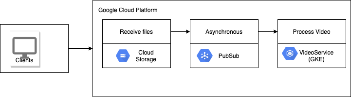

# Video processing service

#### Functionality
Service processes a video file and identifies texts and labels in the video. 
Service listens to the storage bucket for new file and processes the same by retrieving the file from storage bucket.

#### Design
The client sends an image to the app directly to Cloud Storage. Then, Pub/Sub notifications put a message in the Pub/Sub message queue. The message calls a microservice (VideoService) that runs on GKE. The microservice retrieves the video file from Cloud Storage, logs extracted text and labels.



#### Infrastructure

##### Set variables
```
export REGION=asia-east1
export ZONE=asia-east1-a
export PROJECT_ID=msa-gke-demo
export CLUSTER_NAME=img-process-cluster
export GSA_NAME=msa-gcp-sa-key
```
##### Configure Google Cloud Project
```
gcloud config set project YOUR_PROJECT_ID
```

##### Enable required APIs
```
gcloud services enable cloudresourcemanager.googleapis.com pubsub.googleapis.com
gcloud services enable cloudresourcemanager.googleapis.com videointelligence.googleapis.com
```


##### Create GKE cluster and configure
```
gcloud beta container clusters create ${CLUSTER_NAME} --release-channel regular --zone ${ZONE} --num-nodes=3 --enable-autoupgrade
gcloud container clusters get-credentials ${CLUSTER_NAME} --zone ${ZONE}
```
##### Create service account
```
gcloud iam service-accounts create ${GSA_NAME}
gcloud projects add-iam-policy-binding ${PROJECT_ID} --member="serviceAccount:${GSA_NAME}@${PROJECT_ID}.iam.gserviceaccount.com" --role="roles/pubsub.subscriber"

```
##### Create key, download key and create Kubernetes Secret with key
```
gcloud iam service-accounts keys create imgprocess-key.json --iam-account ${GSA_NAME}@${PROJECT_ID}.iam.gserviceaccount.com
kubectl create secret generic pubsub-key --from-file=key.json=imgprocess-key.json
```

##### Create storage bucket and pubsub
```
gsutil mb -c regional -l ${REGION} gs://${PROJECT_ID}-videostore
gcloud pubsub topics create video-service
gcloud pubsub subscriptions create --topic video-service video-workers
gsutil notification create -t video-service -f json -e OBJECT_FINALIZE gs://${PROJECT_ID}-videostore
gsutil notification list gs://${PROJECT_ID}-videostore
```

## Build and deployment

##### Compile and build VideoService
```
mvn clean install
docker build -t video-service:v01 .
docker tag video-service:v01 gcr.io/msa-gke-demo/video-service:v01
gcloud auth configure-docker
docker push gcr.io/msa-gke-demo/video-service:v01

kubectl apply -f gcp-deployment.yaml

kubectl get pods
kubectl logs <pod name>
```
